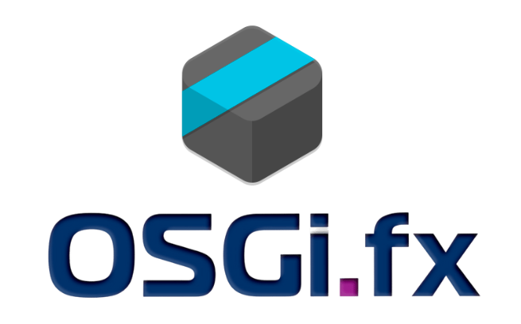

  
   
  
An easy-to-use desktop application to manage OSGi frameworks remotely

  
  
  
  
  
  
  

### ❓ Why OSGi.fx?

**OSGi.fx** is the ultimate remote management tool for your OSGi frameworks. Unlike legacy consoles, it offers a **modern, responsive JavaFX interface** that gives you:
*   **🚀 Deep Insights:** Visualize bundles, services, users, and components instantly.
*   **⚡ Real-time Monitoring:** Track threads, heap usage, and logs live.
*   **�️ Visual Dependencies:** Explore complex relationships with interactive graphs.
*   **✨ Ease of Use:** Drag-and-drop installs, smart auto-complete, and valid configuration editing.

------------------------------------------------------------------------------------------------------------

### �📸 Gallery

  
  
  
  
  
  

------------------------------------------------------------------------------------------------------------

### 🛠️ Tech Stack

| Component | Technology |
| :--- | :--- |
| **☕ Java (Application)** | 25 |
| **☕ Java (Agent)** | 1.8 |
| **🖥️ Rich Client Platform** | JavaFX 25 |
| **⚙️ Runtime (Application)** | OSGi R8 (Equinox), Eclipse 4 (e4), e(fx)clipse |
| **⚙️ Runtime (Agent)** | OSGi R6 |
| **🎨 UI Libraries** | ControlsFX, TilesFX, FormsFX |
| **🛠️ Software Tools** | Bndtools 7.2.1 |

------------------------------------------------------------------------------------------------------------

### 🚀 Getting Started

The latest released version is **2.4.5**.

#### 📥 Download & Install
Visit the [Project Website](http://osgifx.com) to download and install the latest version for your platform.

For detailed instructions, please refer to the **User Guide** on the website or check our local [User Guide](GUIDE.md).

------------------------------------------------------------------------------------------------------------

### ✨ Features

| Feature | Version | Implemented | Released |
| :--- | :---: | :---: | :---: |
| **📦 Bundle Inventory**   _View all installed bundles and fragments_ | 2.4.4 | ✅ | 🚀 |
| **📦 Package Insights**   _Explore exported and imported packages_ | 2.4.4 | ✅ | 🚀 |
| **🛠️ Service Registry**   _Inspect all registered OSGi services_ | 2.4.4 | ✅ | 🚀 |
| **🧩 Component Viewer**   _Visualize declarative services (DS) components_ | 2.4.4 | ✅ | 🚀 |
| **⚙️ System Properties**   _Access robust system and framework properties_ | 2.4.4 | ✅ | 🚀 |
| **🧵 Thread Monitor**   _Track daemon and non-daemon threads_ | 2.4.4 | ✅ | 🚀 |
| **📢 Event Emitter**   _Dispatch synchronous or asynchronous events_ | 2.4.4 | ✅ | 🚀 |
| **👂 Event Listener**   _Subscribe to OSGi events in real-time_ | 2.4.4 | ✅ | 🚀 |
| **📝 Log Stream**   _Live streaming of OSGi logs_ | 2.4.4 | ✅ | 🚀 |
| **logger R7 Logger Config**   _Manage OSGi R7 logger levels and configurations_ | 2.4.4 | ✅ | 🚀 |
| **🐚 Gogo Shell**   _Execute Gogo commands remotely_ | 2.4.4 | ✅ | 🚀 |
| **💻 CLI Executor**   _Run system CLI commands directly_ | 2.4.4 | ✅ | 🚀 |
| **✨ Smart Auto-Complete**   _Intelligent suggestion for remote Gogo commands_ | 2.4.4 | ✅ | 🚀 |
| **📥 Bundle Manager**   _Install, update, starting and stopping bundles_ | 2.4.4 | ✅ | 🚀 |
| **🖱️ Drag & Drop Install**   _Effortless bundle installation via drag-and-drop_ | 2.4.4 | ✅ | 🚀 |
| **🔧 Config Admin**   _Manage configurations via `ConfigurationAdmin`_ | 2.4.4 | ✅ | 🚀 |
| **📋 Metatype Inspector**   _Browse OCDs and property descriptors_ | 2.4.4 | ✅ | 🚀 |
| **⏯️ Bundle Lifecycle**   _Start, stop, and uninstall bundles/fragments_ | 2.4.4 | ✅ | 🚀 |
| **⚡ Component Control**   _Enable or disable DS components on the fly_ | 2.4.4 | ✅ | 🚀 |
| **✏️ Config Editor**   _Create, update, and delete configurations_ | 2.4.4 | ✅ | 🚀 |
| **🏗️ Config Factory**   _Instantiate new configurations from factory PIDs_ | 2.4.4 | ✅ | 🚀 |
| **📊 Runtime Dashboard**   _Overview of memory, uptime, bundles, threads, and services_ | 2.4.4 | ✅ | 🚀 |
| **🕸️ Bundle Graph**   _Visualize bundle dependencies interactively_ | 2.4.4 | ✅ | 🚀 |
| **🔗 Component Graph**   _Visualize DS component references and dependencies_ | 2.4.4 | ✅ | 🚀 |
| **🔄 Cycle Detector**   _Identify circular dependencies in DS components_ | 2.4.4 | ✅ | 🚀 |
| **📤 Graph Export**   _Export dependency graphs to DOT (GraphViz) format_ | 2.4.4 | ✅ | 🚀 |
| **📂 Log Viewer**   _Access and analyze application log files_ | 2.4.4 | ✅ | 🚀 |
| **🕵️ Leak Detector**   _Identify suspicious classloader leaks_ | 2.4.4 | ✅ | 🚀 |
| **🌐 HTTP Runtime**   _Inspect Servlets, Filters, and Resources_ | 2.4.4 | ✅ | 🚀 |
| **📈 Heap Monitor**   _Real-time heap usage and GC tracking_ | 2.4.4 | ✅ | 🚀 |
| **🔌 Extension Manager**   _Install and manage external plugins_ | 2.4.4 | ✅ | 🚀 |
| **🗑️ Extension Uninstaller**   _Remove installed extensions easily_ | 2.4.4 | ✅ | 🚀 |
| **📜 OBR Generator**   _Generate OBR XML repositories_ | 2.4.4 | ✅ | 🚀 |
| **🌲 DMT Explorer**   _Traverse and update the Device Management Tree_ | 2.4.4 | ✅ | 🚀 |
| **👥 User Admin**   _Manage roles, users, and groups_ | 2.4.4 | ✅ | 🚀 |
| **❤️ Health Checks**   _Execute and monitor Felix Health Checks_ | 2.4.4 | ✅ | 🚀 |
| **📸 Snapshot**   _Capture and analyze runtime state snapshots_ | 2.4.4 | ✅ | 🚀 |
| **ℹ️ DTO Inspector**   _Explore standard OSGi Runtime DTOs_ | 2.4.4 | ✅ | 🚀 |
| **🔍 Advanced Search**   _Powerful search across the OSGi framework_ | 2.4.4 | ✅ | 🚀 |
| **🤖 MCP Support**   _Model Context Protocol integration for AI agents. [Read More](MCP_SERVER.md)_ | 2.4.5 | ✅ | 🚀 |
| **👻 Headless Launch**   _Start application with pre-configured connection_ | 2.4.5 | ✅ | 🚀 |

--------------------------------------------------------------------------------------------------------------

### 💡 Troubleshooting & Tips

*   **👻 Headless Mode:** Starting from 2.4.5, need to connect without the connection wizard? Use the `-Dosgifx.config=/path/to/config.json` system property to launch OSGi.fx with a pre-defined connection. See the [Headless Launch Documentation](HEADLESS_LAUNCH.md).
*   **🤖 AI Assistance:** OSGi.fx 2.4.5 supports the **Model Context Protocol (MCP)**, allowing AI agents to connect to and debug your OSGi runtime directly! See the [MCP Server Documentation](MCP_SERVER.md).

--------------------------------------------------------------------------------------------------------------

### 👨‍💻 Maintainer

Amit Kumar Mondal (admin@amitinside.com)

--------------------------------------------------------------------------------------------------------------

### 🤝 Contributing 

Want to contribute? Great! Check out [Contribution Guide](https://github.com/amitjoy/osgifx-console/blob/main/CONTRIBUTING.md)

--------------------------------------------------------------------------------------------------------------

### 📄 License

This project is licensed under Apache License Version 2.0 

--------------------------------------------------------------------------------------------------------------

