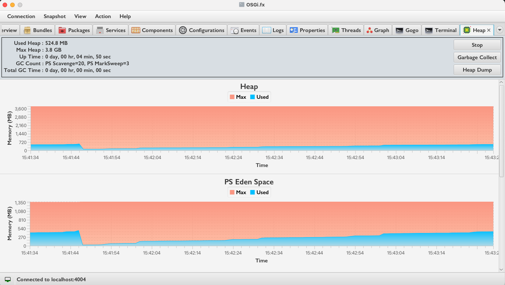

  
   
  
An easy-to-use desktop application to manage OSGi frameworks remotely

  
  
  
  
  
  
  

	

		
<h2>Click here for more screenshots</h2>

		
		
		
		
		
		
		
		
		
		
		
		
		
		
		
		
		
		
		
		
		
		
		
		
		
		
		
		
		
		
		
		
		
		
	

------------------------------------------------------------------------------------------------------------

### Tools and Technologies

|                      	|                                             	|
|----------------------	|---------------------------------------------	|
| Java (Application)    | 17                                         	|
| Java (Agent)          | 1.8                                         	|
| Rich Client Platform 	| JavaFX 17                                    	|
| Runtime Frameworks   	| OSGi R8 (Equinox), Eclipse 4 (e4), e(fx)clipse 	|
| UI Libraries         	| ControlsFX, TilesFX, FormsFX                   |
| Tools                	| Bndtools 6.3.1                                 |

------------------------------------------------------------------------------------------------------------

### Features

|                                                                                                                                                                           |     |
|---------------------------------------------------------------------------------------------------------------------------------------------------------------------------------  |:-:  |
| List all installed bundles and fragments                                                                                                                                          |     |
| List all exported and imported packages                                                                                                                                         |     |
| List all registered services                                                                                                                                                      |     |
| List all registered DS components                                                                                                                                                 |     |
| List all available system and framework properties                                                                                                                                |     |
| List all daemon and non-daemon threads                                                                                                                                            |     |
| Send synchronous or asynchronous events on demand                                                                                                                                 |     |
| Receive events on demand (option to start and stop receiving events)                                                                                                              |     |
| Receive logs on demand (option to start and stop receiving logs)                                                                                                              |     |
| Execute Gogo command                                                                                                                                                              |     |
| Execute CLI command                                                                                                                                                              |     |
| Auto-completion of all available remote Gogo commands during command execution                                                                                                    |     |
| Install or update bundles                                                                                                                                                          |     |
| Drag and drop support of bundles (on Install Bundle Dialog) while installing or updating                                                                                          |     |
| List available configurations from `ConfigurationAdmin`                                                                                                                             |     |
| List `Metatype` property descriptors                                                                                                                                            |     |
| Start/stop/uninstall bundle or fragment                                                                                                                                           |     |
| Enable/disable DS component                                                                                                                                                       |     |
| Update/delete existing configuration                                                                                                                                               |     |
| Create new configuration using metatype descriptor                                                                                                                                 |     |
| Overview of the remote OSGi framework (memory consumption, uptime, framework information, number of bundles, number of threads, number of services and number of DS components)   |     |
| Generate dependency graph for bundles   |     |
| Generate dependency graph for DS components   |     |
| Find all cycles between available DS components   |     |
| Export generated dependency graph to DOT (GraphViz) format (Right click on generated graph) |     |
| Open Diagnostics (Show application log file)  |     |
| Show suspicious classloader leaks 	|   	|
| Show HTTP runtime components (Servlets, Listeners, Filters, Resources and Error Pages) 	|   	|
| Shows heap usage over time and the count of garbage collections 	|   	|
| Install extension (plugin)   |     |
| List and uninstall already installed extension(s)   |     |
| Generate OBR XML   |     |
| Device Management Tree (DMT) Traversal and Update   |     |
| Manage User Admin roles   |     |
| Execute Felix Healthchecks   |     |

--------------------------------------------------------------------------------------------------------------

### Developer

Amit Kumar Mondal (admin@amitinside.com)

--------------------------------------------------------------------------------------------------------------

### Contribution 

Want to contribute? Great! Check out [Contribution Guide](https://github.com/amitjoy/osgifx-console/blob/main/CONTRIBUTING.md)

--------------------------------------------------------------------------------------------------------------

### License

This project is licensed under Apache License Version 2.0 

--------------------------------------------------------------------------------------------------------------

### User Guide

For instructions on how to download and install latest version, please refer to the [Project Website](https://osgifx.com).
