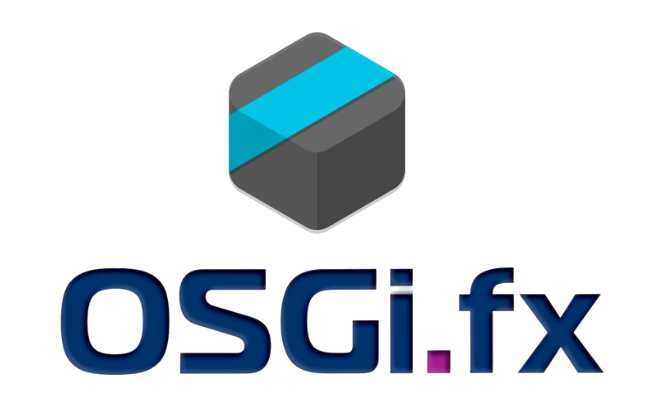

  
   
  
An easy-to-use desktop application to manage OSGi frameworks remotely

### ❓ Why OSGi.fx?

**OSGi.fx** is the ultimate remote management tool for your OSGi frameworks. Unlike legacy consoles, it offers a **modern, responsive JavaFX interface** and **AI-driven capabilities** that give you:
*   **🚀 Deep Insights:** Visualize bundles, services, users, and components instantly.
*   **⚡ Real-time Monitoring:** Track threads, heap usage, and logs live.
*   **🕸️ Visual Dependencies:** Explore complex relationships with interactive graphs.
*   **✨ Ease of Use:** Drag-and-drop installs, smart auto-complete, and valid configuration editing.
*   **🤖 AI Ready:** Built-in **Model Context Protocol (MCP)** server for seamless AI agent integration.

---

### 📸 Gallery

  
  
  
  
  
  

---

### 🛠️ Tech Stack

| Component | Technology |
| :--- | :--- |
| **☕ Java (Application)** | 25 |
| **☕ Java (Agent)** | 1.8 |
| **🖥️ Rich Client Platform** | JavaFX 25 |
| **⚙️ Runtime (Application)** | OSGi R8 (Equinox), Eclipse 4 (e4), e(fx)clipse |
| **⚙️ Runtime (Agent)** | OSGi R6 |
| **🎨 UI Libraries** | ControlsFX, TilesFX, FormsFX |
| **🛠️ Software Tools** | Bndtools 7.2.1 |

---

### 🚀 Getting Started

The latest released version is **2.4.5**.

#### 📥 Download & Install
Visit the [Project Website](http://osgifx.com) to download and install the latest version for your platform.

> [!IMPORTANT]
> **Important Notes for Download and Update:**
> *   The required VM will directly be downloaded while installing the application using `jdeploy`.
> *   If the auto-update feature is enabled, every new version will be automatically downloaded while starting the application.
> *   **Upgrade Note:** Due to the update, the application might not work as expected as the old bundle cache (OSGi storage) still exists. Ensure you delete the existing OSGi storage area located in `~/.osgifx-ws`.

#### Remote Agent Setup

> [!NOTE]
> **Minimum Requirements:** Java 1.8 & OSGi R6.

To manage an OSGi framework, install the `com.osgifx.console.agent` bundle.

**1. Socket Connection**
Set `osgi.fx.agent.socket.port` system property in the runtime (e.g., `2000` or `0.0.0.0:2000`).

**Secure Sockets (SSL):**
To secure sockets, set:
*   `osgi.fx.agent.socket.secure=true`
*   `osgi.fx.agent.socket.secure.sslcontext.filter=my_sslcontext` (filter for SSLContext service)

**2. MQTT Connection**
Install `in.bytehue.messaging.mqtt5.provider.jar`.
*   Configure `in.bytehue.messaging.client` PID.
*   Set Agent Properties:
    *   `osgi.fx.agent.mqtt.pubtopic`: Topic for agent responses.
    *   `osgi.fx.agent.mqtt.subtopic`: Topic for agent requests.

**OAuth Support:**
You can use OAuth tokens instead of passwords. Configure the token in OSGi.fx application settings.

---

### ✨ Features

| Feature | Version | Implemented | Released |
| :--- | :---: | :---: | :---: |
| **📦 Bundle Inventory**   _View all installed bundles and fragments_ | 2.4.4 | ✅ | 🚀 |
| **📦 Package Insights**   _Explore exported and imported packages_ | 2.4.4 | ✅ | 🚀 |
| **🛠️ Service Registry**   _Inspect all registered OSGi services_ | 2.4.4 | ✅ | 🚀 |
| **🧩 Component Viewer**   _Visualize declarative services (DS) components_ | 2.4.4 | ✅ | 🚀 |
| **⚙️ System Properties**   _Access robust system and framework properties_ | 2.4.4 | ✅ | 🚀 |
| **🧵 Thread Monitor**   _Track daemon and non-daemon threads_ | 2.4.4 | ✅ | 🚀 |
| **📢 Event Emitter**   _Dispatch synchronous or asynchronous events_ | 2.4.4 | ✅ | 🚀 |
| **👂 Event Listener**   _Subscribe to OSGi events in real-time_ | 2.4.4 | ✅ | 🚀 |
| **📝 Log Stream**   _Live streaming of OSGi logs_ | 2.4.4 | ✅ | 🚀 |
| **logger R7 Logger Config**   _Manage OSGi R7 logger levels and configurations_ | 2.4.4 | ✅ | 🚀 |
| **🐚 Gogo Shell**   _Execute Gogo commands remotely_ | 2.4.4 | ✅ | 🚀 |
| **💻 CLI Executor**   _Run system CLI commands directly_ | 2.4.4 | ✅ | 🚀 |
| **✨ Smart Auto-Complete**   _Intelligent suggestion for remote Gogo commands_ | 2.4.4 | ✅ | 🚀 |
| **📥 Bundle Manager**   _Install, update, starting and stopping bundles_ | 2.4.4 | ✅ | 🚀 |
| **🖱️ Drag & Drop Install**   _Effortless bundle installation via drag-and-drop_ | 2.4.4 | ✅ | 🚀 |
| **🔧 Config Admin**   _Manage configurations via `ConfigurationAdmin`_ | 2.4.4 | ✅ | 🚀 |
| **📋 Metatype Inspector**   _Browse OCDs and property descriptors_ | 2.4.4 | ✅ | 🚀 |
| **⏯️ Bundle Lifecycle**   _Start, stop, and uninstall bundles/fragments_ | 2.4.4 | ✅ | 🚀 |
| **⚡ Component Control**   _Enable or disable DS components on the fly_ | 2.4.4 | ✅ | 🚀 |
| **✏️ Config Editor**   _Create, update, and delete configurations_ | 2.4.4 | ✅ | 🚀 |
| **🏗️ Config Factory**   _Instantiate new configurations from factory PIDs_ | 2.4.4 | ✅ | 🚀 |
| **📊 Runtime Dashboard**   _Overview of memory, uptime, bundles, threads, and services_ | 2.4.4 | ✅ | 🚀 |
| **🕸️ Bundle Graph**   _Visualize bundle dependencies interactively_ | 2.4.4 | ✅ | 🚀 |
| **🔗 Component Graph**   _Visualize DS component references and dependencies_ | 2.4.4 | ✅ | 🚀 |
| **🔄 Cycle Detector**   _Identify circular dependencies in DS components_ | 2.4.4 | ✅ | 🚀 |
| **📤 Graph Export**   _Export dependency graphs to DOT (GraphViz) format_ | 2.4.4 | ✅ | 🚀 |
| **📂 Log Viewer**   _Access and analyze application log files_ | 2.4.4 | ✅ | 🚀 |
| **🕵️ Leak Detector**   _Identify suspicious classloader leaks_ | 2.4.4 | ✅ | 🚀 |
| **🌐 HTTP Runtime**   _Inspect Servlets, Filters, and Resources_ | 2.4.4 | ✅ | 🚀 |
| **📈 Heap Monitor**   _Real-time heap usage and GC tracking_ | 2.4.4 | ✅ | 🚀 |
| **🔌 Extension Manager**   _Install and manage external plugins_ | 2.4.4 | ✅ | 🚀 |
| **🗑️ Extension Uninstaller**   _Remove installed extensions easily_ | 2.4.4 | ✅ | 🚀 |
| **📜 OBR Generator**   _Generate OBR XML repositories_ | 2.4.4 | ✅ | 🚀 |
| **🌲 DMT Explorer**   _Traverse and update the Device Management Tree_ | 2.4.4 | ✅ | 🚀 |
| **👥 User Admin**   _Manage roles, users, and groups_ | 2.4.4 | ✅ | 🚀 |
| **❤️ Health Checks**   _Execute and monitor Felix Health Checks_ | 2.4.4 | ✅ | 🚀 |
| **📸 Snapshot**   _Capture and analyze runtime state snapshots_ | 2.4.4 | ✅ | 🚀 |
| **ℹ️ DTO Inspector**   _Explore standard OSGi Runtime DTOs_ | 2.4.4 | ✅ | 🚀 |
| **🔍 Advanced Search**   _Powerful search across the OSGi framework_ | 2.4.4 | ✅ | 🚀 |
| **🤖 MCP Support**   _Model Context Protocol integration for AI agents. [Read More](/mcp-server)_ | 2.4.5 | ✅ | 🚀 |
| **👻 Headless Launch**   _Start application with pre-configured connection_ | 2.4.5 | ✅ | 🚀 |

---

### Advanced Capabilities

#### Batch Operations
You can install multiple bundles and create multiple configurations in one go.
1.  Select `Actions -> Batch Install`.
2.  Choose a directory containing your JARs and JSON configuration files.
    *   *Note:* JSON files must comply with the [OSGi Configurator Specification](http://docs.osgi.org/specification/osgi.cmpn/7.0.0/service.configurator.html).
3.  Select which resources to process from the list.

#### Extension System
OSGi.fx is extensible. You can build your own plugins using OSGi and JavaFX.
*   **[Read the Extension Development Guide](/extension-dev)**
*   See the [Tic-Tac-Toe Extension](https://github.com/amitjoy/osgifx/tree/main/com.osgifx.console.extension.ui.tictactoe) for a complete sample.

---

### 💡 Troubleshooting & Tips

*   **👻 Headless Mode:** Starting from 2.4.5, need to connect without the connection wizard? Use the `-Dosgifx.config=/path/to/config.json` system property to launch OSGi.fx with a pre-defined connection. See the [Headless Launch Documentation](/headless-launch).
*   **🤖 AI Assistance:** OSGi.fx 2.4.5 supports the **Model Context Protocol (MCP)**, allowing AI agents to connect to and debug your OSGi runtime directly! See the [MCP Server Documentation](/mcp-server).

---

### 👨💻 Maintainer

[Amit Kumar Mondal](https://github.com/amitjoy) (admin@amitinside.com)

---

### 🤝 Contributing

Want to contribute? Great! Check out our **[Development Guide](/development)** for instructions on building from source and setting up your IDE.

---

### 📄 License

This project is licensed under Apache License Version 2.0 