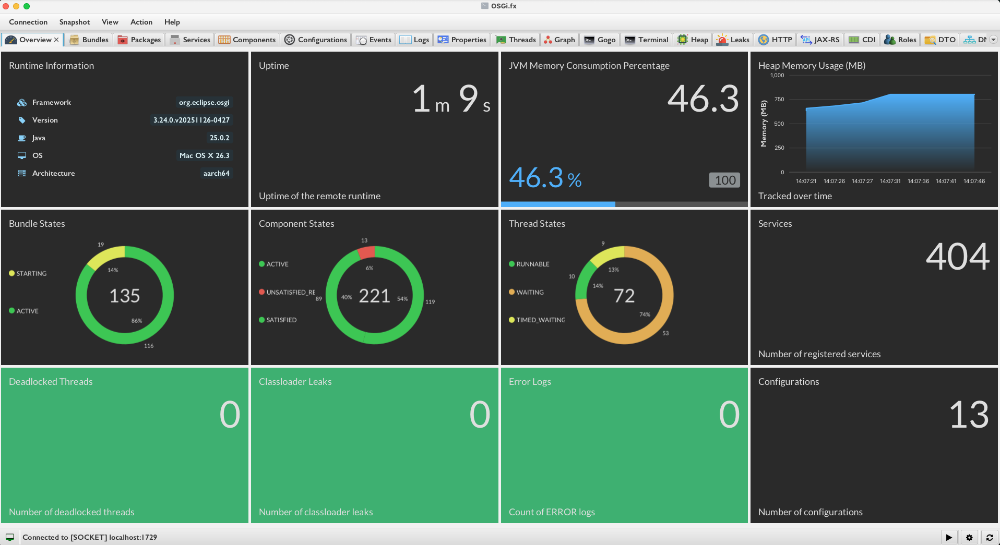
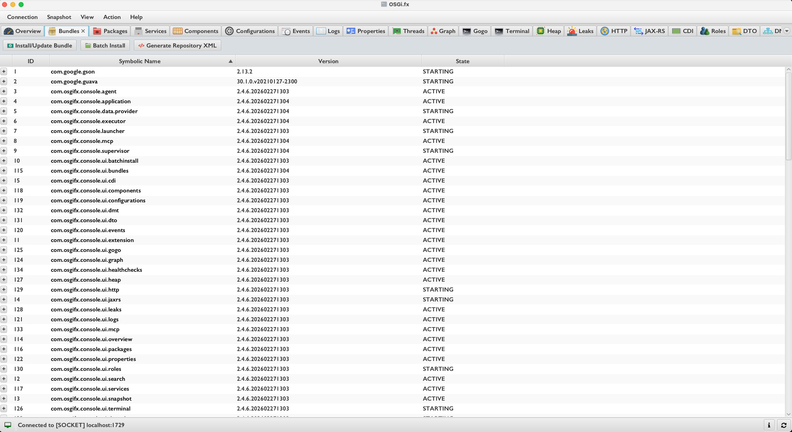
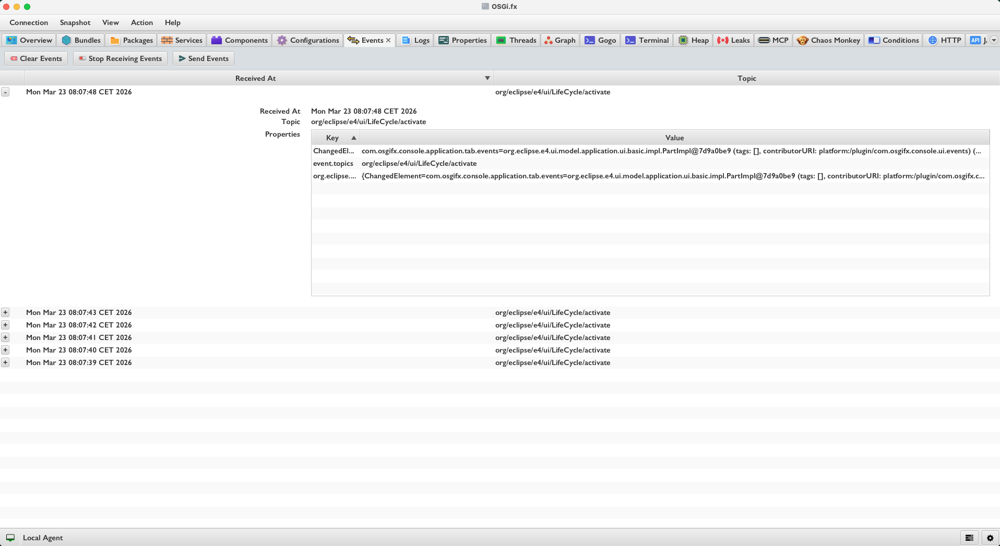
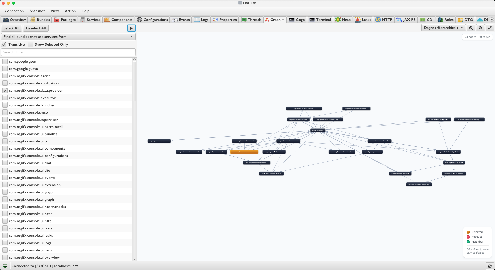
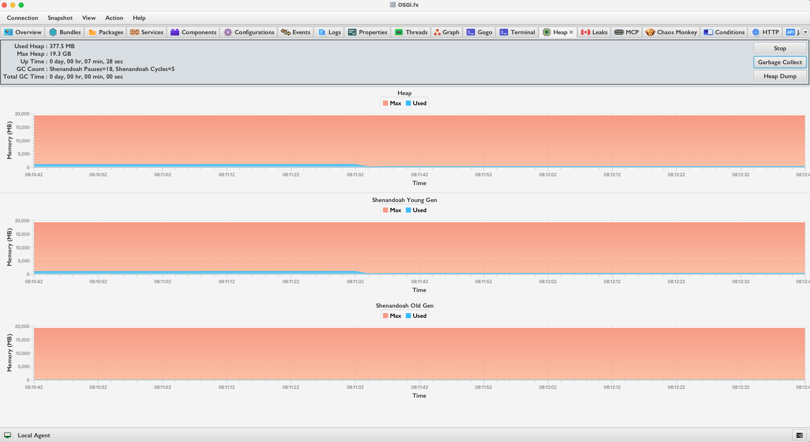
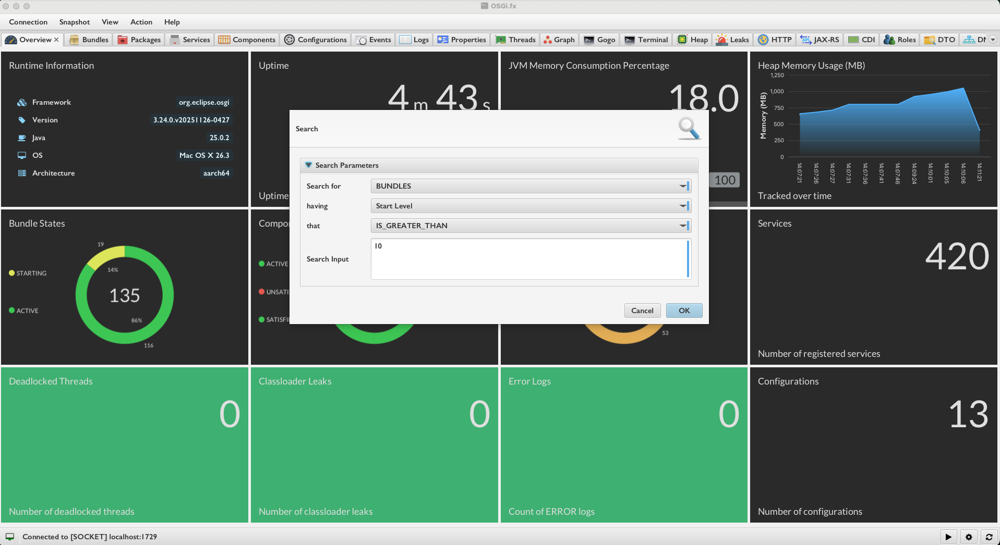
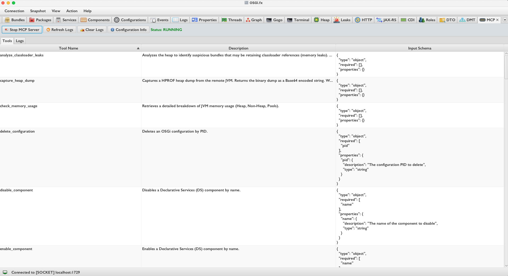
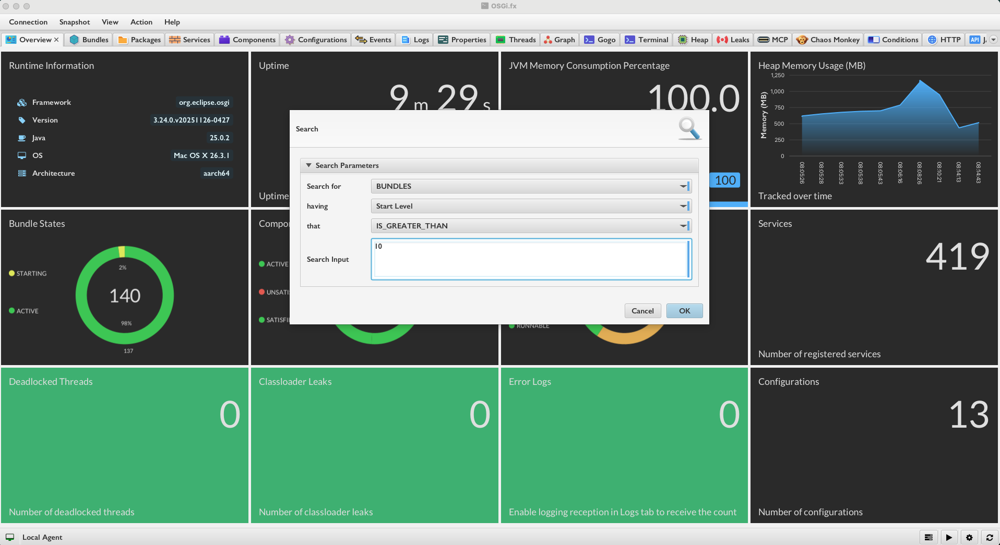

  
   
  
An easy-to-use desktop application to manage OSGi frameworks remotely

### ❓ Why OSGi.fx?

**OSGi.fx** is the ultimate remote management tool for your OSGi frameworks. Unlike legacy consoles, it offers a **modern, responsive JavaFX interface** and **AI-driven capabilities** that give you:
*   **🚀 Deep Insights:** Visualize bundles, services, users, and components instantly.
*   **⚡ Real-time Monitoring:** Track threads, heap usage, and logs live.
*   **🕸️ Visual Dependencies:** Explore complex relationships with interactive graphs.
*   **✨ Ease of Use:** Drag-and-drop installs, smart auto-complete, and valid configuration editing.
*   **🤖 AI Ready:** Built-in **Model Context Protocol (MCP)** server for seamless AI agent integration.

---

### 📸 Gallery

  
  
  
  
  
  
  
  

---

### 🛠️ Tech Stack

| Component | Technology |
| :--- | :--- |
| **☕ Java (Application)** | 25 |
| **☕ Java (Agent)** | 1.8 |
| **🖥️ Rich Client Platform** | JavaFX 25 |
| **⚙️ Runtime (Application)** | OSGi R8 (Equinox), Eclipse 4 (e4), e(fx)clipse |
| **⚙️ Runtime (Agent)** | OSGi R6 |
| **🎨 UI Libraries** | ControlsFX, TilesFX, FormsFX |
| **🛠️ Software Tools** | Bndtools 7.2.1 |

---

### 🚀 Getting Started

The latest released version is **3.0.0**.

#### 📥 Download & Install
Visit the [Project Website](http://osgifx.com) to download and install the latest version for your platform.

> [!IMPORTANT]
> **Important Notes for Download and Update:**
> *   The required VM will directly be downloaded while installing the application using `jdeploy`.
> *   If the auto-update feature is enabled, every new version will be automatically downloaded while starting the application.
> *   **Storage Structure:** The `.osgifx-ws` directory now contains logs, OSGi storage, and your user connection settings. Configured connections are never lost!

#### Remote Agent Setup

> [!NOTE]
> **Minimum Requirements:** Java 1.8 & OSGi R6.

To manage an OSGi framework, install the `com.osgifx.console.agent` bundle. Refer to the **[Agent Documentation](/agent)** for more details.

**1. Socket Connection**
Set `osgi.fx.agent.socket.port` system property in the runtime (e.g., `2000` or `0.0.0.0:2000`).

**Password Authentication:**
Set the `osgi.fx.agent.socket.password=your-secure-password` system property to require password authentication.

**Secure Sockets (SSL):**
To secure sockets, set:
*   `osgi.fx.agent.socket.secure=true`
*   `osgi.fx.agent.socket.secure.sslcontext.filter=my_sslcontext` (filter for SSLContext service)

**2. MQTT Connection**
Install `in.bytehue.messaging.mqtt5.provider.jar`.

  <a href="https://central.sonatype.com/artifact/in.bytehue/in.bytehue.messaging.mqtt5.provider/1.1.0" class="btn btn-secondary" target="_blank" style="padding: 0.25rem 0.75rem; font-size: 0.85rem;">Download MQTT JAR</a>
  <a href="https://github.com/amitjoy/osgi-messaging" class="btn btn-secondary" target="_blank" style="padding: 0.25rem 0.75rem; font-size: 0.85rem;">OSGi Messaging Project</a>

*   Configure `in.bytehue.messaging.client` PID.
*   Set Agent Properties:
    *   `osgi.fx.agent.mqtt.pubtopic`: Topic for agent responses.
    *   `osgi.fx.agent.mqtt.subtopic`: Topic for agent requests.

**OAuth Support:**
You can use OAuth tokens instead of passwords. Configure the token in OSGi.fx application settings.

### ✨ Features

| Feature | Version | Implemented | Released |
| :--- | :---: | :---: | :---: |
| **📦 Bundle Inventory**   _View all installed bundles and fragments_ | 2.4.4 | ✅ | 🚀 |
| **📦 Package Insights**   _Explore exported and imported packages_ | 2.4.4 | ✅ | 🚀 |
| **🛠️ Service Registry**   _Inspect all registered OSGi services_ | 2.4.4 | ✅ | 🚀 |
| **🧩 Component Viewer**   _Visualize declarative services (DS) components_ | 2.4.4 | ✅ | 🚀 |
| **⚙️ System Properties**   _Access robust system and framework properties_ | 2.4.4 | ✅ | 🚀 |
| **🧵 Thread Monitor**   _Track daemon and non-daemon threads_ | 2.4.4 | ✅ | 🚀 |
| **📢 Event Emitter**   _Dispatch synchronous or asynchronous events_ | 2.4.4 | ✅ | 🚀 |
| **👂 Event Listener**   _Subscribe to OSGi events in real-time_ | 2.4.4 | ✅ | 🚀 |
| **📝 Log Stream**   _Live streaming of OSGi logs_ | 2.4.4 | ✅ | 🚀 |
| **🎛️ R7 Logger Config**   _Manage OSGi R7 logger levels and configurations_ | 2.4.4 | ✅ | 🚀 |
| **🐚 Gogo Shell**   _Execute Gogo commands remotely_ | 2.4.4 | ✅ | 🚀 |
| **💻 CLI Executor**   _Run system CLI commands directly_ | 2.4.4 | ✅ | 🚀 |
| **✨ Smart Auto-Complete**   _Intelligent suggestion for remote Gogo commands_ | 2.4.4 | ✅ | 🚀 |
| **📥 Bundle Manager**   _Install, update, starting and stopping bundles_ | 2.4.4 | ✅ | 🚀 |
| **🖱️ Drag & Drop Install**   _Effortless bundle installation via drag-and-drop_ | 2.4.4 | ✅ | 🚀 |
| **🔧 Config Admin**   _Manage configurations via `ConfigurationAdmin`_ | 2.4.4 | ✅ | 🚀 |
| **📋 Metatype Inspector**   _Browse OCDs and property descriptors_ | 2.4.4 | ✅ | 🚀 |
| **⏯️ Bundle Lifecycle**   _Start, stop, and uninstall bundles/fragments_ | 2.4.4 | ✅ | 🚀 |
| **⚡ Component Control**   _Enable or disable DS components on the fly_ | 2.4.4 | ✅ | 🚀 |
| **✏️ Config Editor**   _Create, update, and delete configurations_ | 2.4.4 | ✅ | 🚀 |
| **🏗️ Config Factory**   _Instantiate new configurations from factory PIDs_ | 2.4.4 | ✅ | 🚀 |
| **📊 Runtime Dashboard**   _Overview of memory, uptime, bundles, threads, and services_ | 2.4.4 | ✅ | 🚀 |
| **🕸️ Bundle Graph**   _Visualize bundle dependencies interactively_ | 2.4.4 | ✅ | 🚀 |
| **🔗 Component Graph**   _Visualize DS component references and dependencies_ | 2.4.4 | ✅ | 🚀 |
| **🔄 Cycle Detector**   _Identify circular dependencies in DS components_ | 2.4.4 | ✅ | 🚀 |
| **📤 Graph Export**   _Export dependency graphs to DOT (GraphViz) format_ | 2.4.4 | ✅ | 🚀 |
| **📂 Log Viewer**   _Access and analyze application log files_ | 2.4.4 | ✅ | 🚀 |
| **🕵️ Leak Detector**   _Identify suspicious classloader leaks_ | 2.4.4 | ✅ | 🚀 |
| **🌐 HTTP Runtime**   _Inspect Servlets, Filters, and Resources_ | 2.4.4 | ✅ | 🚀 |
| **📈 Heap Monitor**   _Real-time heap usage and GC tracking_ | 2.4.4 | ✅ | 🚀 |
| **🔌 Extension Manager**   _Install and manage external plugins_ | 2.4.4 | ✅ | 🚀 |
| **🗑️ Extension Uninstaller**   _Remove installed extensions easily_ | 2.4.4 | ✅ | 🚀 |
| **📜 OBR Generator**   _Generate OBR XML repositories_ | 2.4.4 | ✅ | 🚀 |
| **🌲 DMT Explorer**   _Traverse and update the Device Management Tree_ | 2.4.4 | ✅ | 🚀 |
| **👥 User Admin**   _Manage roles, users, and groups_ | 2.4.4 | ✅ | 🚀 |
| **❤️ Health Checks**   _Execute and monitor Felix Health Checks_ | 2.4.4 | ✅ | 🚀 |
| **📸 Snapshot**   _Capture and analyze runtime state snapshots_ | 2.4.4 | ✅ | 🚀 |
| **ℹ️ DTO Inspector**   _Explore standard OSGi Runtime DTOs_ | 2.4.4 | ✅ | 🚀 |
| **🔍 Advanced Search**   _Powerful search across the OSGi framework_ | 2.4.4 | ✅ | 🚀 |
| **🤖 MCP Support**   _Model Context Protocol integration for AI agents. [Read More](/mcp-server)_ | 2.4.5 | ✅ | 🚀 |
| **👻 Headless Launch**   _Start application with pre-configured connection. [Read More](/headless-launch)_ | 2.4.5 | ✅ | 🚀 |
| **🌐 JAX-RS View**   _Inspect JAX-RS Applications, Resources, and Extensions_ | 3.0.0 | ✅ | 🚀 |
| **📦 CDI View**   _Inspect CDI Containers, Components, and Extensions_ | 3.0.0 | ✅ | 🚀 |
| **🔐 Authentication & Security**   _Password authentication with AES-256 encryption, TLS/SSL, and OAuth/Token support_ | 3.0.0 | ✅ | 🚀 |
| **💥 Blast Radius Analysis**   _Pre-flight simulation of impact when stopping bundles or disabling components_ | 3.0.0 | ✅ | 🚀 |
| **🌊 Activation Cascade Analysis**   _Predictive analysis of service activations and hijacking when starting bundles or enabling components_ | 3.0.0 | ✅ | 🚀 |
| **🐒 Chaos Monkey**   _Resilience and fault-injection testing for bundles and components_ | 3.0.0 | ✅ | 🚀 |
| **🕵️ Conditions Monitor**   _Inspect system conditions and inject/revoke mocks_ | 3.0.0 | ✅ | 🚀 |

---

### 🚀 OSGi.fx Client Features & Capabilities

OSGi.fx comes loaded with a plethora of features designed to make remote OSGi management seamless. While most of the options reflect standard capabilities expected by developers familiar with OSGi, several advanced features significantly enhance productivity and diagnostics.

#### 🩺 Advanced Diagnostics
*   **Thread Dump & Heap Dump**: Capture and analyze threads and heap memory directly from the remote runtime. Thread dumps assist in detecting deadlocks or CPU spikes natively, while heap dumps help pinpoint memory leaks. Heap dumps utilize the Large Payload Handling SPI for efficient transferring and local storage.
*   **Snapshot Functionality**: Take a complete snapshot of the remote runtime state (bundles, services, components, properties, etc.). This is incredibly useful for capturing the state at a specific point in time, comparing multiple states to trace issues, attaching to bug reports, or reviewing the environment offline for root-cause analysis without requiring a persistent connection to the agent.

#### ⚙️ Advanced Component Management
*   **Conditions (with Injection)**: OSGi Declarative Services (DS) components often define conditions for activation. You can seamlessly inject these conditions directly from the UI to satisfy and simulate requirements, triggering component activations on demand. This is an awesome functionality for testing component lifecycles without writing any additional scaffolding code or manual configurations.
*   **Batch Operations**: Install multiple bundles and create multiple configurations simultaneously by selecting a directory or multiple JAR files in the Bundles tab. This drastically reduces the time needed to deploy updates, install third-party libraries, or set up a new remote environment. (*Note:* JSON files must comply with the [OSGi Configurator Specification](http://docs.osgi.org/specification/osgi.cmpn/7.0.0/service.configurator.html).)

#### 📢 Event Administration
*   **Sending and Receiving Events**: You can both listen to and emit OSGi events through the EventAdmin interface. Use the intuitive **Event Filter Dialog** to easily construct LDAP filters for subscribing to specific topics. The dialog features an autocomplete dropdown that displays options recognized by OSGi in event filters, drastically simplifying the manual creation of complex filtering rules.

#### 🐒 Chaos Monkey - Resilience Testing
The **Chaos Monkey** is a powerful fault-injection tool designed to test the resilience, self-healing, and dynamic rebinding capabilities of your OSGi applications. It randomly disrupts bundles and SCR components based on your configuration.
*   **4-Layer Safety Architecture**: Prevents accidental "suicide" of the remote environment (protects System Bundle, Agent Bundle, Infrastructure Bundles, and enforces strict Regex Scopes).
*   **Use Cases**: Test bundle refresh cascades, component rebinding scenarios, and ensure your services degrade securely over an Auto-Stop Timer.

#### 🔍 Global Search and Table Filtering
*   **Menu Search Option**: Quickly find functions, specific tabs, and preferences by using the global search field located directly in the application menu.
*   **Table Column Search**: Every table in OSGi.fx allows for advanced inline searching. **Right-click on any column header** to see the option to search for matching entries within that specific column. It makes locating specific bundles, components, or properties trivial even within enormous datasets.

#### 📊 Bottom Status Bar
The bottom status bar of the OSGi.fx UI provides vital connection health and synchronization utilities:
*   **RPC Progress Dialog**: A spinner/icon indicates ongoing Remote Procedure Calls (RPC). Clicking it opens the RPC Progress Dialog, which is highly beneficial for debugging and monitoring slow or long-running network requests, giving visibility into what operations are actively communicating with the runtime.
*   **Sync Button**: Allows you to force-synchronize the client's localized state with the remote runtime. Using the **"Sync All"** menu option immediately invalidates all client-side caches and pulls the freshest data from the remote runtime, ensuring you always observe the most accurate state if the runtime was modified externally.

#### 🧩 Extension System
OSGi.fx is deeply extensible. You can build your own plugins using OSGi and JavaFX.
*   **[Read the Extension Development Guide](/extension-dev)**
*   See the [Tic-Tac-Toe Extension](https://github.com/amitjoy/osgifx/tree/main/com.osgifx.console.extension.ui.tictactoe) for a complete sample.

---

### 💡 Troubleshooting & Tips

*   **👻 Headless Mode:** Starting from 2.4.5, need to connect without the connection wizard? Use the `-Dosgifx.config=/path/to/config.json` system property to launch OSGi.fx with a pre-defined connection. See the [Headless Launch Documentation](/headless-launch).
*   **🤖 AI Assistance:** OSGi.fx 2.4.5 supports the **Model Context Protocol (MCP)**, allowing AI agents to connect to and debug your OSGi runtime directly! See the [MCP Server Documentation](/mcp-server).

---

### 👨‍💻 Maintainer

[Amit Kumar Mondal](https://github.com/amitjoy) (admin@amitinside.com)

---

### 🤝 Contributing

Want to contribute? Great! Check out our **[Development Guide](/development)** for instructions on building from source and setting up your IDE.

---

### 📄 License

This project is licensed under Apache License Version 2.0