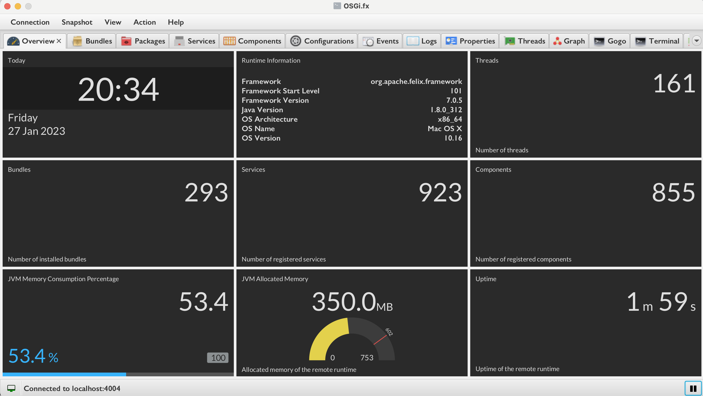
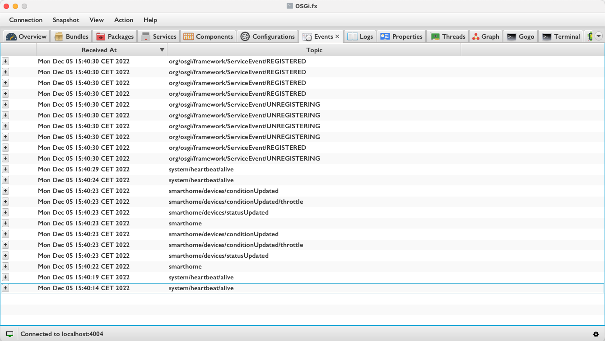

OSGi.fx is an easy-to-use application to remotely manage OSGi frameworks. Similar to Felix web console, this is an endeavour for desktop application users to provide all the necessary functionalities to remotely manage OSGi runtimes.

#### Application Screenshots

	

		
<h4>Click here for more screenshots</h4>

		
		
		
		
		
		
		
		
		
		
		
		
		
		
		
		
		
		
		
		
		
		
		
		
		
		
		
		
		
		
		
		
		
		
		
	

--------------------------------------------------------------------------------------------------------------

#### Implemented Features

|                                                                                                                                                                           |     |
|---------------------------------------------------------------------------------------------------------------------------------------------------------------------------------  |:-:  |
| List all installed bundles and fragments                                                                                                                                          |     |
| List all exported and imported packages                                                                                                                                         |     |
| List all registered services                                                                                                                                                      |     |
| List all registered DS components                                                                                                                                                 |     |
| List all available system and framework properties                                                                                                                                |     |
| List all daemon and non-daemon threads                                                                                                                                            |     |
| Send synchronous or asynchronous events on demand                                                                                                                                 |     |
| Receive events on demand (option to start and stop receiving events)                                                                                                              |     |
| Receive logs on demand (option to start and stop receiving logs)                                                                                                              |     |
| Manage R7 Logger Configurations                                                                                   |     |
| Execute Gogo command                                                                                                                                                              |     |
| Execute CLI command                                                                                                                                                              |     |
| Auto-completion of all available remote Gogo commands during command execution                                                                                                    |     |
| Install or update bundles                                                                                                                                                          |     |
| Drag and drop support of bundles (on Install Bundle Dialog) while installing or updating                                                                                          |     |
| List available configurations from `ConfigurationAdmin`                                                                                                                             |     |
| List `Metatype` property descriptors                                                                                                                                            |     |
| Start/stop/uninstall bundle or fragment                                                                                                                                           |     |
| Enable/disable DS component                                                                                                                                                       |     |
| Update/delete existing configuration                                                                                                                                               |     |
| Create new configuration using metatype descriptor                                                                                                                                 |     |
| Overview of the remote OSGi framework (memory consumption, uptime, framework information, number of bundles, number of threads, number of services and number of DS components)   |     |
| Generate dependency graph for bundles   |     |
| Generate dependency graph for DS components   |     |
| Find all cycles between available DS components   |     |
| Export generated dependency graph to DOT (GraphViz) format (Right click on generated graph) |     |
| Open Diagnostics (Show application log file)  |     |
| Show suspicious classloader leaks 	|   	|
| Show HTTP runtime components (Servlets, Listeners, Filters, Resources and Error Pages) 	|   	|
| Shows heap usage over time and the count of garbage collections 	|   	|
| Install extension (plugin)   |     |
| List and uninstall already installed feature(s)   |     |
| Generate OBR XML   |     |
| Device Management Tree (DMT) Traversal and Update   |     |
| Manage User Admin Roles   |     |
| Execute Felix Healthchecks   |     |

#### Tools and Technologies

|                      	|                                             	|
|----------------------	|---------------------------------------------	|
| Java (Application)    | 17                                         	|
| Java (Agent)          | 1.8                                         	|
| Rich Client Platform 	| JavaFX 17                                    	|
| Runtime Frameworks   	| OSGi R8 (Equinox), Eclipse 4 (e4), e(fx)clipse 	|
| UI Libraries         	| ControlsFX, TilesFX, FormsFX                  |
| Tools                	| Bndtools 6.3.1                                 |

--------------------------------------------------------------------------------------------------------------

#### Important Notes for Download and Update

* The application is distributed through [jdeploy](https://www.jdeploy.com) enabling developers to distribute native applications effortlessly
* Note that, the required VM will directly be downloaded while installing the application using `jdeploy`
* Also note that, if the auto-update feature is enabled, every new version will be automatically downloaded while starting the application
* Due to the update of the application, the application might not work expectedly as the old bundle cache still exists. That's why, make sure to delete the existing OSGi storage area located in `~/.osgifx-ws`

--------------------------------------------------------------------------------------------------------------

#### Minimum Requirements for Runtime Agent

1. Java 1.8
2. OSGi R6

To use the agent in the OSGi environment, you need to install `com.osgifx.console.agent.jar` and set `osgi.fx.agent.port` system property in the runtime. Note that, you can either set the property to any port e.g. `2000` or `0.0.0.0:2000`. The latter one will allow remote connections whereas the former one will only allow connections from `localhost`.

--------------------------------------------------------------------------------------------------------------

#### Batch Install

You can also install multiple bundles and create multiple configurations in one go. For that, you need to create `fxartifacts` directory in your home folder and keep all bundles and configuration JSON files in it. Then you can choose `Batch Install` from the `Actions` menu
and it will list only the JARs and JSON files from the directory. You can then choose from the list which JARs to install and which configurations to create.

Note that, the configuration JSON files need to comply with [OSGi Configurator Specification](http://docs.osgi.org/specification/osgi.cmpn/7.0.0/service.configurator.html)

--------------------------------------------------------------------------------------------------------------

#### Extension Development

External plugins or extensions can easily be developed for `OSGi.fx`. Please have a look at how the bundles with `com.osgifx.console.ui.*` project name pattern are developed. As a starting point, please have a look at the sample [Tic-Tac-Toe](https://github.com/amitjoy/osgifx/tree/main/com.osgifx.console.extension.ui.tictactoe). Since `OSGi.fx` has itself been developed using **OSGi** and **Eclipse e4**, you can easily leverage their modular capabilities to build your own extensions.

Once the extension is developed, you can test it by installing it from the `Help -> Install Extension` menu option.

Note that, to develop an extension, you need to provide OSGi Deployment Package archive. Have a look at [OSGi Deployment Admin Specification](http://docs.osgi.org/specification/osgi.cmpn/7.0.0/service.deploymentadmin.html) on how to prepare such deployment packages.

For ease of development, you can use the OSGi.fx workspace to further develop your own extensions as the workspace comprises a new bnd plugin which will enable you to automatically generate a deployment package from a bndrun file. As an example, please refer to the sample [Tic-Tac-Toe extension](https://github.com/amitjoy/osgifx/tree/main/com.osgifx.console.extension.ui.tictactoe).

--------------------------------------------------------------------------------------------------------------

#### Project Import for Development

1. Install `Bndtools` from Eclipse Marketplace
2. Import all the projects (`File -> Import -> General -> Existing Projects into Workspace` and select `Search for nested projects`)

--------------------------------------------------------------------------------------------------------------

#### Building from Source

Run `./gradlew clean build` in the project root directory

--------------------------------------------------------------------------------------------------------------

#### Developer

[Amit Kumar Mondal](https://github.com/amitjoy) (admin@amitinside.com)

--------------------------------------------------------------------------------------------------------------

#### Contribution

--------------------------------------------------------------------------------------------------------------

#### License

