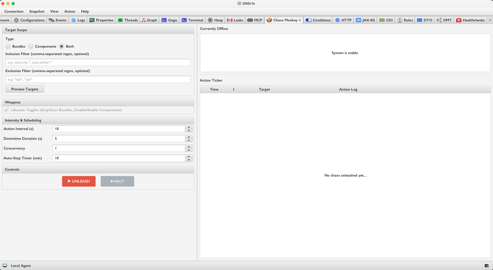
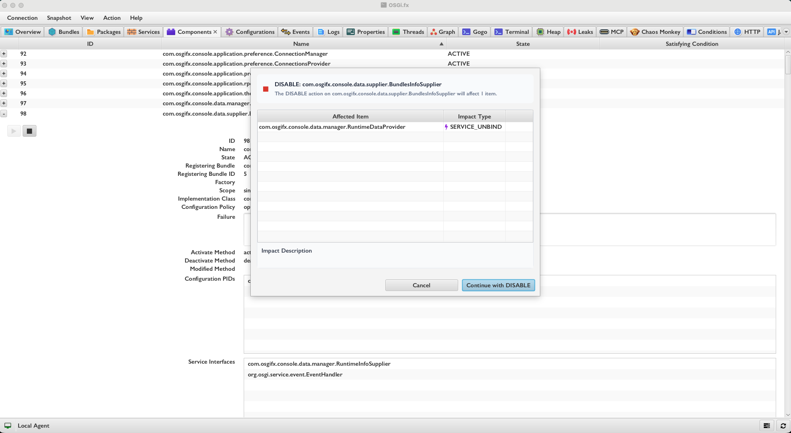
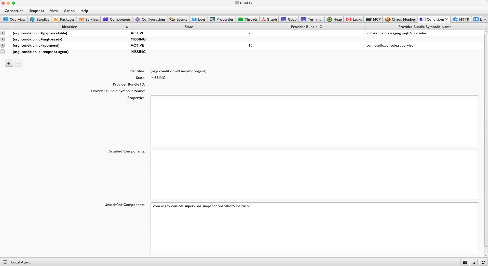
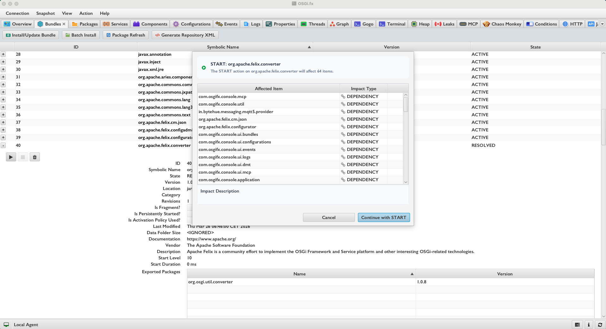

# Resilience & Observability

OSGi's dynamic service model is both its greatest strength and its most common source of subtle, hard-to-diagnose bugs in production. OSGi.fx ships four advanced features that turn the invisible mechanics of runtime dynamism into something **observable, testable, and safe**:

| Feature | Summary |
| :--- | :--- |
| [🐒 Chaos Monkey](#-chaos-monkey--fault-injection-testing) | Continuously and randomly disrupts bundles/components to prove your runtime is resilient |
| [💥 Blast Radius Analysis](#-blast-radius-analysis--pre-flight-stop-simulation) | Shows exactly what will break *before* you stop a bundle or disable a component |
| [🕵️ Conditions Monitor](#️-conditions-monitor--inject--revoke-mocked-osgi-conditions-live) | Surfaces hidden OSGi R8 Conditions and lets you inject or revoke mocks live |
| [🌊 Activation Cascade Analysis](#-activation-cascade-analysis--predict-service-hijacking-before-it-happens) | Predicts service hijacking and unexpected activations *before* you start a bundle or enable a component |

---

## 🐒 Chaos Monkey — Fault-Injection Testing



### What It Does

Chaos Monkey is a **live, automated fault-injector** that randomly and continuously disrupts your OSGi runtime, then self-heals — inspired by Netflix Chaos Engineering, adapted for OSGi's bundle/component model.

You configure what to target, at what frequency, and for how long. The engine runs autonomously, disrupts victims, reverts them after their downtime expires, and cleans up completely when halted. Your runtime is always left in a valid state.

### How It Works

The engine is built from three cooperating classes:

| Class | Responsibility |
| :--- | :--- |
| `ChaosConfig` | Holds all user settings: target type, filters, timing, concurrency |
| `TargetSelector` | Picks eligible victims at each cycle using inclusion/exclusion glob filters |
| `ChaosEngine` | The scheduled loop that disrupts, reverts, and logs all actions |

**Each engine cycle:**
1. Checks the auto-stop timer — halts automatically after the configured duration
2. **Reverts expired victims** — calls `agent.start()` or `agent.enableComponentById()` for any victim whose downtime has elapsed
3. **Selects new victims** — shuffles all eligible targets, limits to the configured concurrency count, then calls `agent.stop()` or `agent.disableComponentById()`

**Safety by design** — the selector never touches:
- Bundle `0` (the system bundle)
- The OSGi.fx Remote Agent bundle
- Anything matching the user-defined **exclusion glob filter**

**Configuration options:**

| Setting | Range | Description |
| :--- | :---: | :--- |
| Target Type | `BUNDLES`, `COMPONENTS`, `BOTH` | What kind of artifacts to disrupt |
| Inclusion Filter | glob pattern | Only target matching names |
| Exclusion Filter | glob pattern | Never target matching names |
| Action Interval | 5–60 s | Time between disruption cycles |
| Downtime Duration | 1–30 s | How long a victim stays offline |
| Concurrency | 1–10 | Maximum simultaneous victims |
| Auto-Stop Timer | 1–60 min | Engine halts automatically after this duration |

**Preview (dry-run):** The **Preview** button runs target selection without applying the concurrency limit, showing you the full pool of eligible victims *before* unleashing anything — a safe pre-flight check for the Chaos session itself.

**Live UI:** An **Action Ticker** table streams every disruption and revert in real time (timestamp / emoji icon / target name / state). An **Offline Targets** list shows what is currently down at any moment.

### Why This Matters

OSGi's dynamic service model is its greatest strength — but that same dynamism is the most common source of bugs in production. Chaos Monkey *proves* (not assumes) that your system is resilient: that optional service bindings degrade gracefully, that mandatory references recover after a bundle restart, and that no hidden race conditions lurk in activation/deactivation phases.

> The name is no coincidence. [Chaos Monkey](https://netflix.github.io/chaosmonkey/) is a well-known open-source chaos engineering tool originally built by Netflix that randomly terminates virtual machine instances and services in production to test resilience. OSGi.fx adopts the same philosophy — and the same name — applied to the OSGi bundle and component model.

---

## 💥 Blast Radius Analysis — Pre-flight Stop Simulation



### What It Does

Before you stop a bundle or disable a DS component, Blast Radius Analysis runs a **static simulation on live runtime data** and presents a complete, categorised impact report. No changes are made to the runtime until you explicitly confirm.

It answers the question: *"If I stop this bundle right now, what else breaks?"*

### How It Works

The analysis is a pure static computation driven by two `ImpactAnalyzer` utility classes — one in `ui.bundles` (for bundle stop/uninstall), one in `ui.components` (for component disable). Both operate on a snapshot of the live runtime state fetched from the connected agent.

**For bundle stop or uninstall:**

1. **Package Wiring (BFS traversal)** — builds a directed dependency graph from `ImportedPackages` → `ExportedPackages` wiring and BFS-traverses from the target bundle:
   - `DEPENDENCY` — bundle has static wiring to the provider; the wiring persists in JVM memory even after the bundle is stopped (OSGi spec behaviour)
   - `STALE_WIRING` — on *uninstall*, those wires become stale and remain until `PackageAdmin.refreshPackages()` is explicitly called

2. **Service Unbind** — checks all bundles consuming services registered by the target bundle:
   - `SERVICE_UNBIND` — that consumer will lose its service binding immediately

3. **SCR Component Deactivation** — for every DS component that has a satisfied reference bound to a service the target bundle registers, it counts how many *other* providers exist for that interface:
   - Zero other providers → `DEACTIVATION` (the component goes unsatisfied and deactivates)
   - At least one other provider → `SERVICE_UNBIND` (the component loses one binding but stays alive)
   - Optional reference → `SERVICE_UNBIND` (simply unbound, no deactivation)

**For component disable:**

Same service/SCR logic, no package-wiring traversal needed since DS components do not export packages.

**Each impact row shows:**
- **Affected Item** — the bundle symbolic name or component name
- **Impact Type** — `DEACTIVATION`, `SERVICE_UNBIND`, `DEPENDENCY`, or `STALE_WIRING`
- **Description** — a human-readable explanation of exactly what will happen and why

### Why This Matters

Most OSGi consoles give you a `STOP` command. None of them tell you what will break.

In a microkernel with dozens or hundreds of interdependent services, a single bundle stop can cascade into deactivations you never expected — mandatory references become unsatisfied, optional references silently unbind, and package wires become stale. Blast Radius Analysis makes the invisible chain of consequences **explicit before you act**.

---

## 🕵️ Conditions Monitor — Inject & Revoke Mocked OSGi Conditions Live



### What It Does

The Conditions Monitor lets you **observe every OSGi R8 Condition** in your runtime — whether it is active, missing, or mocked — and **inject or revoke synthetic conditions** without redeploying anything.

### Background: What Is an OSGi Condition?

Introduced in OSGi R8, a *Condition* is a named service typically carrying the property `osgi.condition.id`. DS components can declare a reference targeting a specific condition via a standard LDAP filter:

```java
@Reference(target = "(osgi.condition.id=com.acme.gps.available)")
Condition gpsAvailableCondition;
```

While `osgi.condition.id` is the conventional property, any arbitrary LDAP filter can be used. It simply matches against the properties of any registered `Condition` service. If no matching condition service is registered in the framework, the component stays permanently `UNSATISFIED` — even if every other dependency is satisfied. This makes conditions a powerful but completely opaque gating mechanism.

### The IoT Hardware-Dependency Problem

In IoT and embedded OSGi deployments, conditions are the standard idiom for **hardware-contingent feature activation**:

1. A hardware detector bundle scans for a physical device (GPS module, CAN bus interface, temperature sensor…)
2. If the hardware is found → the bundle registers an OSGi Condition service (`osgi.condition.id = com.acme.gps.available`)
3. All feature components that depend on that hardware declare a reference targeting this condition
4. Without the hardware present → those components stay permanently `UNSATISFIED` — by design

This is elegant in production, but creates a real problem during development and CI: **you cannot test the hardware-contingent feature logic without the physical hardware**. In a pure software environment, a CI pipeline, or a developer workstation, the condition is simply never registered.

**OSGi.fx solves this directly:**

- Find the `MISSING` condition (`com.acme.gps.available`) in the monitor — you can immediately see which components it is blocking
- Click **Inject** → a mock Condition service is registered in the remote runtime with the required properties
- The DS framework immediately evaluates all pending references — the hardware-contingent components **activate without any physical hardware present**
- Test, verify, debug
- Click **Revoke** → the mock is removed, the runtime returns to its original state

Zero code changes. Zero redeployment. No hardware required.

### How It Works

**Each condition is described by `XConditionDTO`:**

| Field | Description |
| :--- | :--- |
| `identifier` | The condition ID (e.g. `com.acme.gps.available`) |
| `state` | `ACTIVE`, `MISSING`, or `MOCKED` |
| `providerBundleId` | Bundle currently providing this condition (`-1` if none) |
| `properties` | Service properties the condition carries |
| `satisfiedComponents` | DS components that are activated because this condition is present |
| `unsatisfiedComponents` | DS components that are blocked because this condition is absent |

**The UI (`ConditionsFxController`):**

- Sortable, filterable table listing all conditions in the runtime regardless of state
- Expandable rows with per-condition detail: provider bundle, properties, satisfied and unsatisfied component lists
- `MOCKED` state highlighted in **orange** — never confused with real conditions
- Orphaned conditions (no related components of any kind) highlighted in **slate blue** — useful for spotting stale or misconfigured conditions

**Inject path (`MockConditionDialog`):**
- Automatically parses the component's `targetFilter` OSGi LDAP string and **pre-fills the dialog** with the expected key-value pairs — no manual typing of filter properties
- Additional properties can be added as needed
- On confirm → `agent.injectMockCondition(identifier, properties)` registers a synthetic Condition in the remote framework

**Revoke path:**
- `agent.revokeMockCondition(identifier)` removes the mock
- The **Inject** button is only enabled for `MISSING` conditions; the **Revoke** button is only enabled for `MOCKED` conditions — preventing invalid operations

### Why This Matters

The hardware-availability gating workflow described above is idiomatic in IoT OSGi systems — but the core insight applies far beyond IoT. Think of OSGi Conditions as **feature flags at the framework level**: a condition can gate any feature, capability, or subsystem, not just hardware. Security readiness, licence checks, cloud connectivity, database availability — all can be modelled as conditions.

OSGi.fx fixes the testability gap entirely: you find the `MISSING` condition, see which components it's blocking, click **Inject**, and the hardware-contingent (or feature-flagged) components activate on the spot — no hardware, no code change, no redeployment. **Revoke** restores everything when you're done.

Beyond inject/revoke, the Conditions Monitor gives you complete visibility of the condition landscape:

- **All conditions in any state** — `ACTIVE`, `MISSING`, or `MOCKED` — are listed in one place
- **Per-condition detail** — which bundle provides it, which components it satisfies, which components it blocks
- **Orphaned conditions** — conditions that exist but have no relation to any component are highlighted, useful for spotting stale or misconfigured conditions
- **Precise gating answers** — the `satisfiedComponents` and `unsatisfiedComponents` lists answer exactly *"which components does condition X gate?"* without any guesswork

---

## 🌊 Activation Cascade Analysis — Predict Service Hijacking Before It Happens



### What It Does

Activation Cascade Analysis is the **forward-looking counterpart** to Blast Radius Analysis. Where Blast Radius asks *"what breaks if I stop this?"*, Activation Cascade asks *"what activates — and what gets hijacked — if I start this?"*

Before you start a bundle or enable a DS component, it runs a simulation on live runtime data and presents a complete, categorised prediction report. No changes are made until you confirm.

### What Is Service Hijacking?

In OSGi's dynamic service model, when multiple providers register the same service interface, the framework and DS select the provider with the **highest service ranking** (lowest service ID as the tiebreaker). This is a feature — it allows graceful upgrades and overrides.

But it is also a hazard: if a newly started bundle registers an implementation with a higher ranking than the existing provider, **every consumer silently switches** to the new provider. The old provider is still there, the consumer is still active, everything *looks* fine — but it is now bound to a completely different implementation.

This silent substitution is especially dangerous when:
- You deploy a hotfix bundle that accidentally outranks a singleton service
- You enable a diagnostic/mock component that registers a competing implementation
- You start a bundle during live maintenance without realising it carries a higher-ranked service

### How It Works

**For bundle start:**

1. **Package Wiring (BFS traversal)** — builds the bundle dependency graph and traverses from the starting bundles:
   - `ACTIVATION` — a currently-inactive bundle may now start because its missing package dependency will be provided
   - `DEPENDENCY` — a currently-active bundle already has static wiring to this provider

2. **Component service availability** — collects all service interfaces that will appear when the bundles start (from DS components *and* non-DS registered services). For every DS component already in the runtime:
   - `SATISFACTION` — was `UNSATISFIED` or blocked; will now have its mandatory reference fulfilled and will activate
   - `DEPENDENCY` — was already active; will bind to an *additional* provider ⚠️ **potential hijacking** if the new provider has a higher service ranking

3. **Component activation** — DS components hosted by the starting bundles themselves are shown as `ACTIVATION` (they will come to life as their host bundle starts)

**For component enable:**

Same service-layer logic without the package BFS traversal.

**Each impact row shows:**
- **Affected Item** — the bundle symbolic name or component name
- **Impact Type** — `ACTIVATION`, `SATISFACTION`, or `DEPENDENCY` (the last being the hijack-risk signal)
- **Description** — a human-readable explanation

### Why This Matters

The symmetry with Blast Radius Analysis is intentional: just as stopping something has downstream *victims*, starting something has downstream *beneficiaries* — and sometimes uninvited *substitutions*.

Service hijacking is the most subtle and dangerous failure mode in OSGi production systems, precisely because **everything looks fine**: the replaced service is still there, the consumer is still active, but it is now silently bound to a different implementation. There is no error, no warning, and no obvious signal that anything changed.

Activation Cascade Analysis makes this prediction **explicit before the bundle or SCR component is ever started**. Before you take action, you can foresee every downstream component and bundle that will be affected by the operation — which ones will newly activate, which ones will have their references satisfied for the first time, and — critically — which ones will silently rebind to a new provider. You get the full picture of the cascade upfront, so you can decide whether to proceed, adjust the service ranking, or choose a different deployment strategy.

This is particularly valuable during:
- **Live hotfix deployment** — verify the fix bundle only touches what it intends to and does not accidentally outrank a critical singleton service
- **Feature rollout** — understand the full activation chain a new bundle triggers across the runtime
- **Post-failure recovery** — know exactly what wakes up, and in what order, when you restart a stalled subsystem

---

## Summary

These four features form a **complete resilience and observability toolkit** for the OSGi dynamic service model:

| Feature | Timing | Direction | Key Question Answered |
| :--- | :---: | :---: | :--- |
| 🐒 **Chaos Monkey** | Live | Continuous mutation | Is my runtime actually resilient? |
| 💥 **Blast Radius** | Pre-flight | Stop → downstream | What breaks if I stop this? |
| 🕵️ **Conditions Monitor** | Live | Bidirectional inspect + inject | Why is this component still unsatisfied? |
| 🌊 **Activation Cascade** | Pre-flight | Start → downstream | What activates — or gets hijacked — if I start this? |

Together they turn OSGi's greatest strength — **runtime dynamism** — from a latent source of subtle, hard-to-debug failures into a well-understood, testable, and observable system property.

---

### Related Pages

- [Getting Started](/) — download, install, and set up the agent
- [MCP Server](/mcp-server) — AI-driven diagnostics via Model Context Protocol
- [Remote Agent Documentation](/agent) — connect OSGi.fx to your framework
